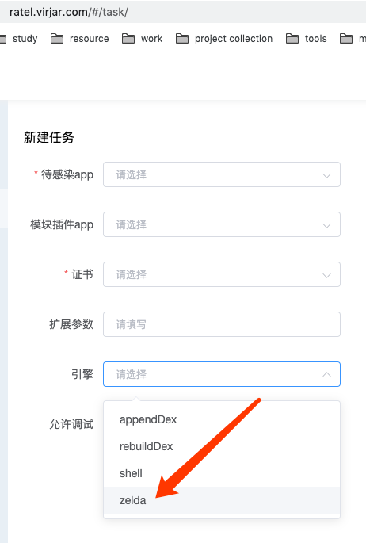

# zelda
Zelda是一个多开分身框架，目前Zelda已经有开源的分支: https://github.com/virjar/zelda zelda的实现原理主要是修改apk的pkgName,同时修正app的各种变量。对标MT管理器的apk共存方案。

Zelda的闭源版本是架设在ratel框架之上的，所以拥有ratel的一切特性。当然Ratel很早期就支持了``一机多号``功能，一机多号本身也类似一种弱化的分身方案。所以Zelda和一机多号模式肯定存在冲突。所以Zelda引擎下，一机多号API将会失效。

## 使用

输出构建APK文件的时候，选择zelda引擎即可

## 注意事项

zelda多开依靠改多包方法实现，无法通过客户端切换配置实现多开。所以多开多少次就需要执行多少次zelda构建任务。每次zelda构建产生的apk的包名都会不一样