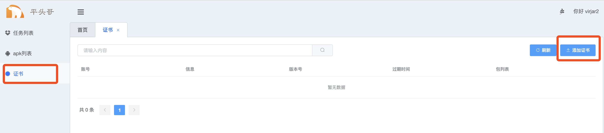
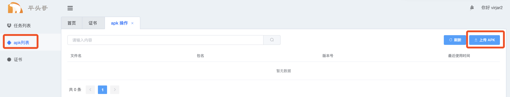
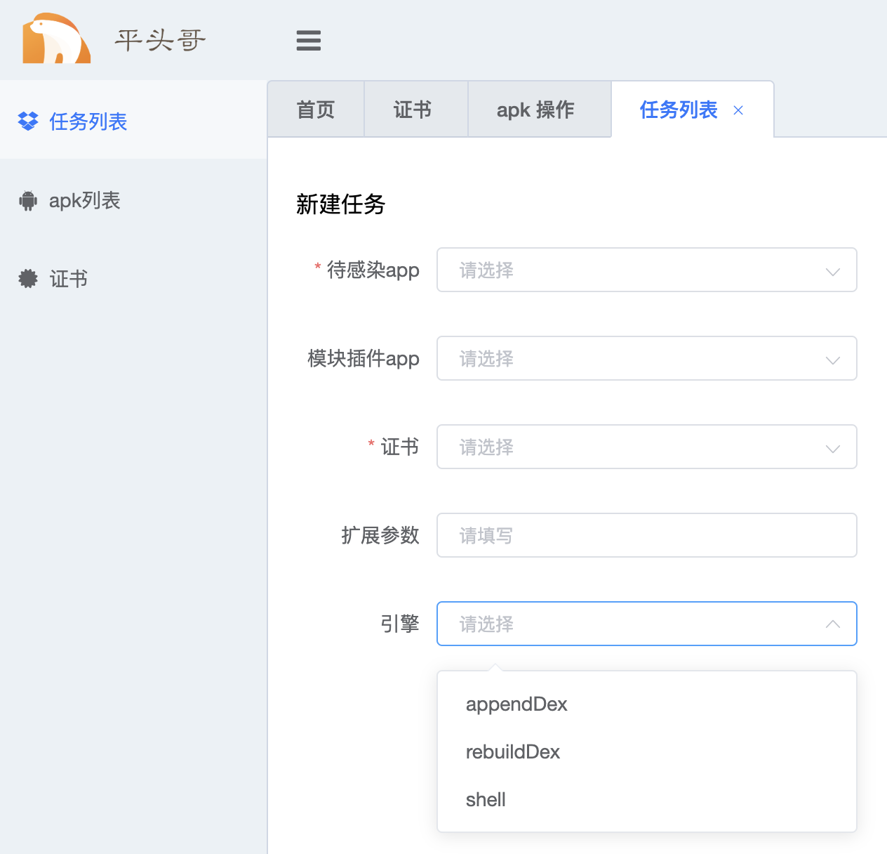

# ratel server

ratel server是ratel提供的在线app感染平台，app工作需要对apk内容进行修改，修改工作则是通过ratel server来实现。将apk上传到ratelserver，创建apk构建任务，然后下载任务输出的apk。

ratel server的使用方式如下

## 注册登陆
这里不过多讲述，即正常网站的注册登陆流程。

## 导入入证书
为限制ratel使用超出我们的控制，我们会对每个app是否可以使用ratel，使用那些功能通过一个特定的证书来控制。证书将会贯穿整个ratel组件工作生命周期。证书的申请请联系我们的客服人员。

## apk上传
apk上传，在上传页面选择需要被处理的apk即可，如果你需要构建embed模式的apk(xposed 模块内置到输出apk中)。那么可以同时上传xposed模块apk即可

## 创建任务
ratel的主要功能，便是对apk进行打包处理。所以整个页面是重要的功能。

任务创建只有两个必传参数，带感染app和证书,其他的都为可选值

各参数解释如下
### 待感染的app
其实就是将要被重打包处理的apk，也就是正常运行在手机系统的应用。不过前提是你需要将它上传到ratel server平台，才可以在这里被选择

### 插件模块app
本参数可选，如果你选择了插件模块app，那么最终构建的app中，将会内置本次传入的模块，这就是ratle定义的embed模式打包。此时原始apk和模块将会绑定打包，embed模式相对于external可能有少许性能提升。
更主要的是，embed模式扩展功能可以和原始app绑定发包，且可以在没有ratelmanager的情况下正常work。此时非常适合apk的改造后二次分发。

需要注意的是，embed模式，目前最多只支持一个模块apk植入

### 证书
授权信息，这个之前有解释，我们通过证书机制来限定用户许可行为

### 扩展参数
扩展参数是apk构建过程附加的额外参数，可以实现特色的功能设定（主要是控制ratel的内部属性）。
如开启虚拟设备指纹: ``ratel_properties_virtualEnvModel=START_UP``

具体的扩展参数含义和其作用，将在后续展开 TODO

###  引擎
ratel打包有三种模式，分别为: ``rebuildDex``| ``appendDex``|``shell``,三种含义解释如下
1. rebuildDex 通过对入口dex的入口代码重编实现代码注入。（无入口application和入口activity的app不支持这种模式）
2. appendDex通过append multidex的方式实现代码注入
3. 通过shell原理的方式包装app

三种引擎模式的解释可以参考这篇文章： https://bbs.pediy.com/thread-252823.htm

ratel引擎默认使用rebuildDex模式

## task操作
