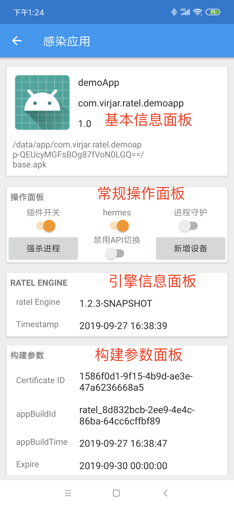
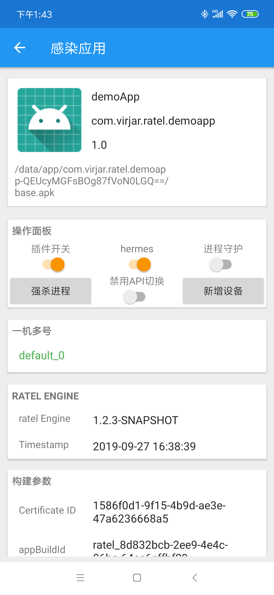
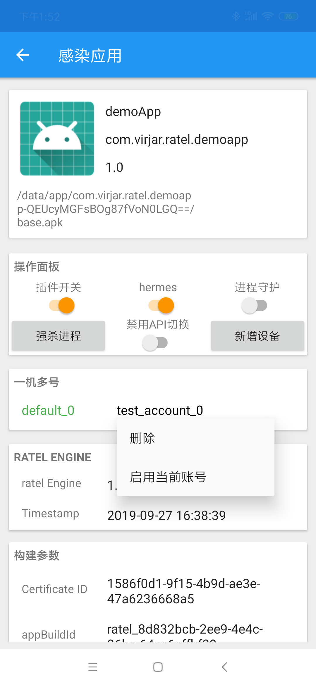

# 虚拟化相关
虚拟化章节主要描述ratel提供的设备指纹对抗功能，设备指纹对抗和改机工具不是等价概念。对改机工具而言，包括修改机型、序列号、imei等，然而手机中存在大量弱唯一ID属性，以及存在一些改机工具逃离方法、存在危险环境检测手段。ratel希望在一个尽量正常的手机环境中（无root、无危险app、考虑模拟器AOSP等），实现ID属性飘逸，且保证ID数据校验可靠性、ID属性飘逸范围合法性、ID属性数据关联不被破坏。ratel希望实现设备指纹方案无法唯一定位ratel放大的各个设备，虽然ratel提供了常规设备定位信息自定义接口（IMEI，serial等），但是我们并不建议通过外部干预这些信息的飘逸。

# 一机多号
在前面章节已经叙述过ratel提供的几种虚拟化模式，在这几种模式中，目前看起来使用较多，而且操作较为复杂的为MULTI模式，甚至我把这模式单独命名为``一机多号``，一机多号可以达到类似VirtualApp那种无限多开的效果，当然和virtualApp相比有些优势和弱势。下面使用一个demo来叙述ratel一机多号操作流程。

## 操作面板简述

1. 基础信息面板显示当前被ratel感染的app的基本信息，点击这个面板可以打开app，需要给ratelManager提供打开其他app的权限。
2. 常规操作面板提供一些简单的操作指定app的功能，部分功能需要app处于运行态才能使用。
3. 引擎信息面板显示当前app使用的引擎
4. 构建参数面板显示部分app构建的时候的相关信息。

可以看到，正常情况下，并没有操作一机多号的入口。
## 一机多号操作面板

ratelManager处理一机多号，需要满足两个条件：
1. app虚拟模式处在multi模式下下，加入构建参数:``ratel_properties_virtualEnvModel=MULTI``或者在插件中指定``<meta-data android:name="virtualEnvModel" android:value="Multi" />``
2. app处于运行态

满足两个条件之后，即可看到一机多号操作面板，如下:

可以看到，默认情况下，app有一个默认设备``default_0``。这里解释一下，ratel一机多号约定，每个设备需要有一个名字，作为虚拟设备的唯一标记，名字只可以使用数字、下划线、字母组成。

### 创建设备
在操作面板中，有一个创建设备的按钮，点击后在弹窗中输入一个设备ID（随意起名字，只能使用数字、下划线、字母组成），确定之后即可看到一个新的设备出现在一机多号面板中。

### 切换设备&删除设备
上图可以看到，一机多号中，点击设备item可以弹出操作菜单，提供删除设备和切换设备功能

### api切换设备冲突解决

在之前章节有过讲诉，ratel支持使用插件代码控制切换设备`` RatelToolKit.virtualEnv.switchEnv("18782164555");`` 在ratel生命周期中，ratelManager控制切换和插件控制切换，都应该生效，但是如果他们传入的id不相同，则会导致二义性，实际表现则是，ratel会使用插件的逻辑为主。

如果你的插件存在控制切换设备逻辑，那么在ratelManager中直接控制切换将会失效，你可以通过两种方案使得设备切换以ratelManager为主。
1. 注释插件中切换设备代码
2. 勾选ratelManager操作面板中，``禁用API切换``按钮。

这个功能的主要使用场景是：
1. 在没有编程能力的用户中，使用一机多号功能
2. 在存在编程的自动化控制场景下，切换到指定账户，进行设备状态场景还原(比如，某个账号被封禁，切换到指定账号，观察被封禁的表现)