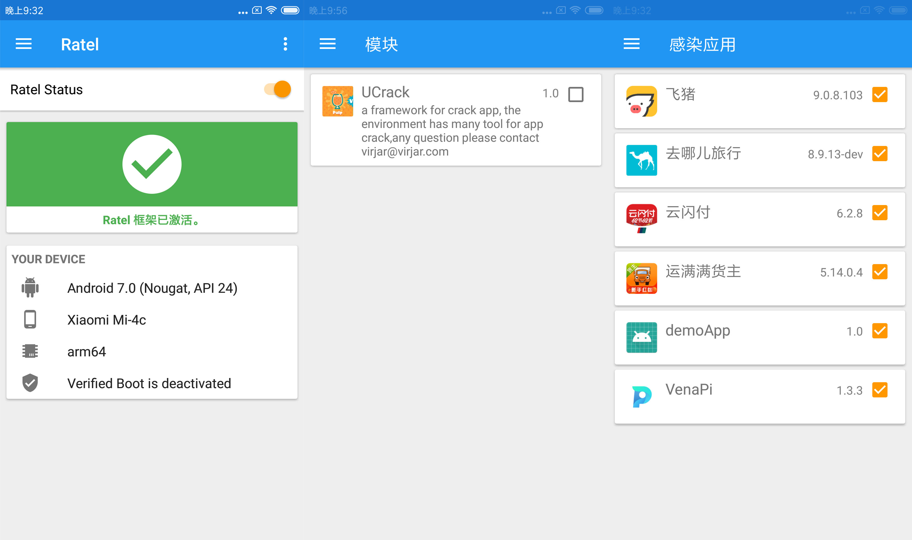
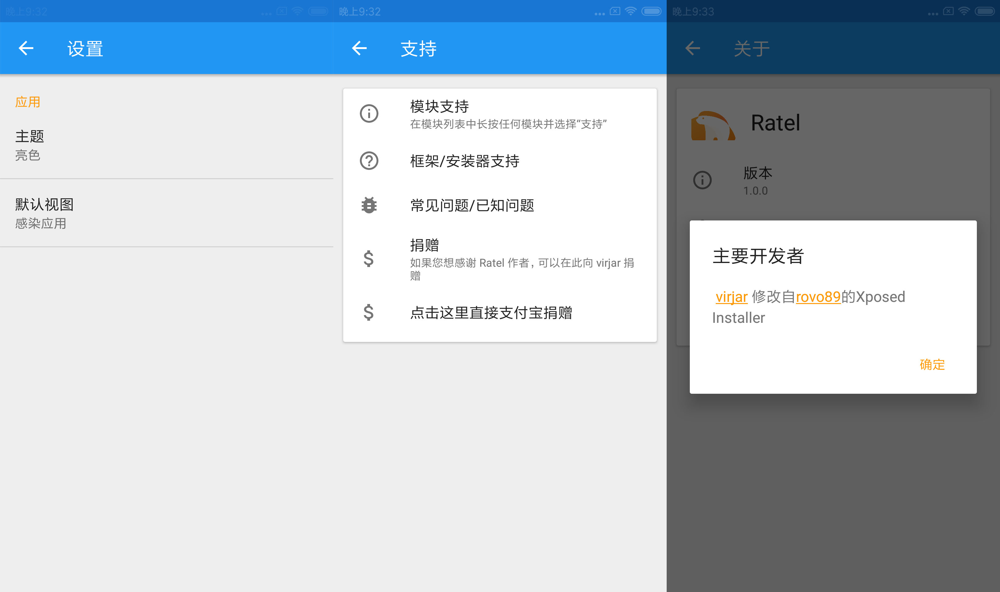

# ratel-doc

# 捐赠
求请我和咖啡，不要瑞幸优惠券，要钱

# 文档正文
平头哥（ratel）是一个能够在免root手机中使用xposed的框架。支持5.0-9.0。使用ratel可以任意控制app的行为，如同开启上帝模式一样。他有如下特性：

1. 完全支持9.0（理论上Android10也是支持的，只是没有测试），对比xposed框架本身在8.0的时候就各种使用不顺畅了
2. 免root运行，ratel运行，不需要root后者解锁bootloader。现在新手机获得root权限越来越困难。ratel可以实现免root下DIY你的手机
3. 痕迹隐藏，对于root，xposed等常见风险操作检测，ratel框架从原理上就避免了他们。就我个人测试，一些银行类app可以正常被ratel控制。
4. 无法影响全局，受限于实现原理，ratel无法影响系统。只能影响正常安装在手机里面的app。
5. ratel模块开发，无需重启手机即可生效（就xposed框架本身来说，也可以通过一定手段达到这个效果，参考我的另一个项目[ucrack](https://gitee.com/virjar/ucrack)）
6. API扩展，ratel在xposed framework层面之上，提供了ratel独有的一些特殊API。可以实现一些xposed本身不提供的强大功能。当然，如果你按照标准的xposed API开发，那么ratel支持绝大部分xposed特性
7. external&embed模式共存，在免root环境下，如果把模块植入到app内部，那么可以使得这个app可以被广大普通用户直接使用。因为DIY功能的使用门槛降低到了只需要下载AndroidAPK了。可以理解为您家老人都可以正常使用ratel了
9. 内置设备模拟+一健新机+多账号共存功能。这个功能各位不要滥用，比较狂暴

# Ratel Manager

RatelManager的作用类似XposedInstaller，实现对Ratel模块的管理，不过需要注意的是，embed模式下的模块，可以在没有RatelManager的环境下直接运行。

